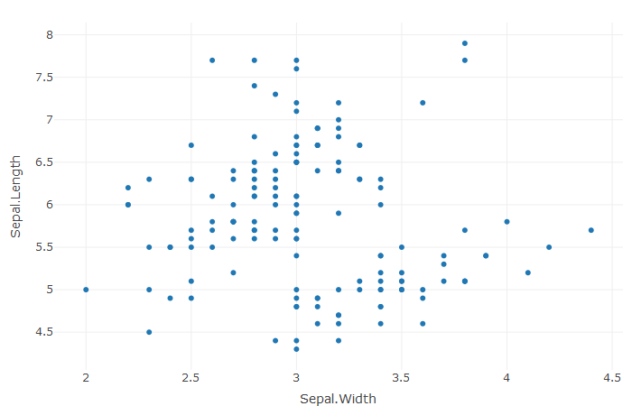

Scatter Plots - Iris Dataset
========================================================
author: Krishna
date: 16/1/2019
autosize: true

Project Details:
========================================================
- A simple shiny app that is developed to plot the scatter plots of selected Axes
- This application uses columns from the iris dataset 
- The iris dataset is one of the best known datasets and can be loaded into rstudio directly by following commands:

```r
library(datasets)
data("iris")
```


Iris - Dataset:
========================================================


```r
library(datasets)
data("iris")
head(iris)
```

```
  Sepal.Length Sepal.Width Petal.Length Petal.Width Species
1          5.1         3.5          1.4         0.2  setosa
2          4.9         3.0          1.4         0.2  setosa
3          4.7         3.2          1.3         0.2  setosa
4          4.6         3.1          1.5         0.2  setosa
5          5.0         3.6          1.4         0.2  setosa
6          5.4         3.9          1.7         0.4  setosa
```
*Attribute Information*:

- Sepal.Length  : sepal length in cm 
- Sepal.Width   : sepal width in cm 
- Petal.Length  : petal length in cm 
- Petal.Width   : petal width in cm 
- Species       : class (Iris Setosa, Iris Versicolour, Iris Virginica)

Sample Plot:
========================================================
- The sample scatter plot developed using plot_ly package is presented 


Links:
========================================================
- Shiny application:
    + <a href=" https://tbrk1608.shinyapps.io/DDP_4/">Click Here </a>
    
- GitHub repo:
    + <a href=" https://github.com/krrish16/datasciencecoursera/tree/master/Developing_Data_Products/Week_4">Click Here </a>


## Thank You

