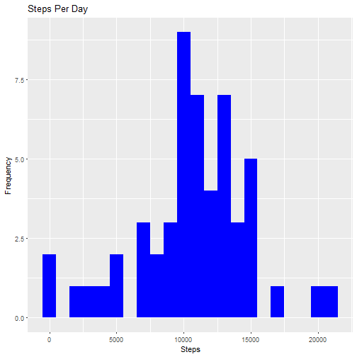
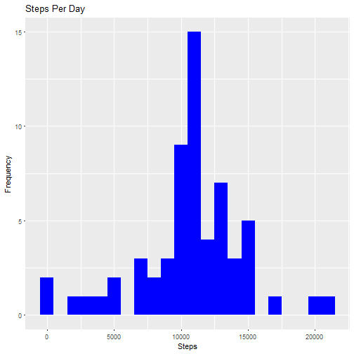

## Loading Data


```r
library(ggplot2)
data <- read.csv("./activity.csv")
head(data)
```

```
##   steps       date interval
## 1    NA 2012-10-01        0
## 2    NA 2012-10-01        5
## 3    NA 2012-10-01       10
## 4    NA 2012-10-01       15
## 5    NA 2012-10-01       20
## 6    NA 2012-10-01       25
```

## Missing Values


```r
sapply(data, function(x) sum(is.na(x)))
```

```
##    steps     date interval 
##     2304        0        0
```

## Removing NA's


```r
na_rows <- which(is.na(data$steps))
re_na_data <- data[-na_rows,]
```

## Number of Steps per day


```r
stepsperday <- aggregate(steps ~ date,data = data , FUN = sum)
head(stepsperday)
```

```
##         date steps
## 1 2012-10-02   126
## 2 2012-10-03 11352
## 3 2012-10-04 12116
## 4 2012-10-05 13294
## 5 2012-10-06 15420
## 6 2012-10-07 11015
```

## Histogram


```r
ggplot(stepsperday, aes(x = steps))+geom_histogram(fill = "blue", binwidth=1000)+labs(title = "Steps Per Day", x = "Steps", y = "Frequency")
```



## Mean and Median of the total number of steps taken per day


```r
mean_steps <- mean(stepsperday$steps)
median_steps <- median(stepsperday$steps)
print(paste("mean : ", round(mean_steps,2)))
```

```
## [1] "mean :  10766.19"
```

```r
print(paste("median : ", round(median_steps,2)))
```

```
## [1] "median :  10765"
```

## Average daily activity pattern


```r
interval_steps <- aggregate(steps ~ interval,data = re_na_data , FUN =mean)
ggplot(interval_steps, aes(x = interval, y=steps))+geom_line(color="blue")+labs(title = "Steps by Interval", x = "interval", y = "steps")
```


## 5 min interval with max no. of steps


```r
max_interval <- interval_steps[which.max(interval_steps$steps),]
max_interval
```

```
##     interval    steps
## 104      835 206.1698
```

## Number of missing values


```r
sapply(data, function(x) sum(is.na(x)))
```

```
##    steps     date interval 
##     2304        0        0
```

## Filling NA's with mean of steps and creating a new Data set


```r
new_data <- data
Val <- tapply(data$steps, data$interval, mean, na.rm=TRUE, simplify=TRUE)
new_data$steps[na_rows] <- Val[as.character(new_data$interval[na_rows])]
```

## New Data Histogram


```r
new_stepsperday <- aggregate(steps ~ date,data = new_data , FUN = sum)
head(new_stepsperday)
```

```
##         date    steps
## 1 2012-10-01 10766.19
## 2 2012-10-02   126.00
## 3 2012-10-03 11352.00
## 4 2012-10-04 12116.00
## 5 2012-10-05 13294.00
## 6 2012-10-06 15420.00
```

```r
ggplot(new_stepsperday, aes(x = steps))+geom_histogram(fill = "blue", binwidth=1000)+labs(title = "Steps Per Day", x = "Steps", y = "Frequency")
```



## Mean and Median of the total number of steps taken per day for new data


```r
new_mean_steps <- mean(new_stepsperday$steps)
new_median_steps <- median(new_stepsperday$steps)
print(paste("mean : ", round(new_mean_steps,2)))
```

```
## [1] "mean :  10766.19"
```

```r
print(paste("median : ", round(new_median_steps,2)))
```

```
## [1] "median :  10766.19"
```
### Here the mean value for both cases are equal but in case of median there's a slight variation

## Differences in activity patterns

```r
new_data$date <- as.Date(as.character(data$date))
new_data$day <- weekdays(new_data$date)
#?ifesle
new_data$is_weekend <- ifelse(new_data$day=="Saturday" | new_data$day=="Sunday","yes", "no")
weekends <- aggregate(steps ~ is_weekend + interval,data = new_data,FUN = mean)
ggplot(weekends, aes(x = interval, y=steps, color= is_weekend)) + geom_line() + facet_grid(is_weekend ~ .) + labs(title = "Mean of Steps by Interval", x = "interval", y = "steps")
```


### It seems to be that there are more number of steps during weekends
